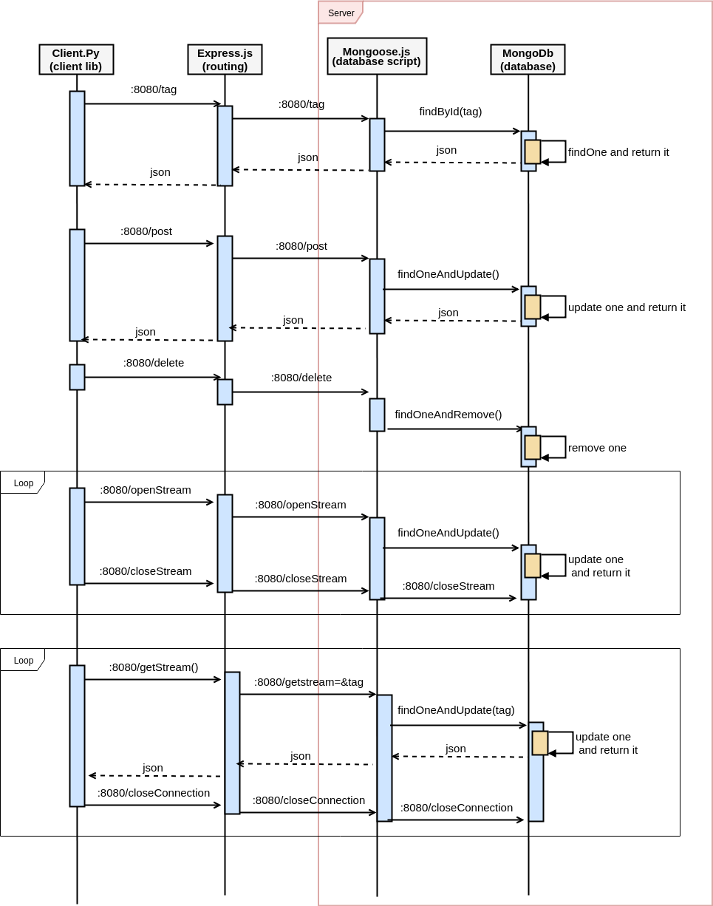

## Social garden rest Api and client
This repository contains a web service and a python API to interact with the service.

Description of subsection:

* [Webservice repository](https://github.com/RohlederCPH/socialgarden/tree/master/web)
* [Socialgarden python API repository](https://github.com/RohlederCPH/socialgarden/tree/master/python)

## Webserver info
* [Current webserver http://159.65.116.139:3000](http://159.65.116.139:3000)
* [Query all devices http://159.65.116.139:3000/devices](http://159.65.116.139:3000/devices)
* [Look up on name http://159.65.116.139:3000/devices/mystream](http://159.65.116.139:3000/devices/mystream3)

The interaction between client and database through mongoose.js and express.js.

Express.js handles the routing of the application.
Mongoose handles the interaction with MongoDb

To setup service locally. navigate to 'web-social-gardens' and enter 'npm start'

## Sequence diagram
The following sequence diagram is intented to provide a overview of the whole system.

[project notes](https://drive.google.com/open?id=1g8jVPm2a03rIj1w0h3tP_TUUs5uruUis)
