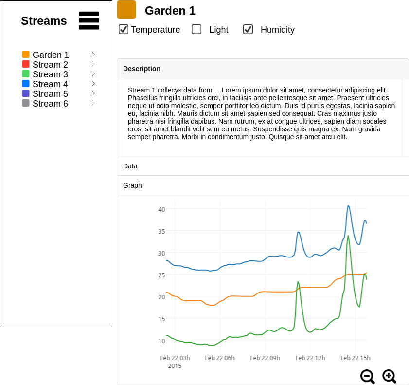

This application is based on the MEAN stack. meaning no appache is needed. make sure to disable it
https://www.npmjs.com/package/node-autostart

# Socialgarden web service

This project was generated with [Angular CLI](https://github.com/angular/angular-cli) version 1.7.4.

## Install
run `npm install` from commandline

## Run server

Run `npm start` for a dev server. Navigate to `http://localhost:3000/`. The app will automatically reload if you change any of the source files.


### Further help

To get more help on the Angular CLI use `ng help` or go check out the [Angular CLI README](https://github.com/angular/angular-cli/blob/master/README.md).


## MEANstack

### M = [MongoDB](https://www.mongodb.com/what-is-mongodb)
In the Meanstack, we use MongoDb for hosting Database. This is a noSQL Database.The advantage of noSQL over sql, is that this system is very recilient to errors. For instance, can we change a object to hold new attributes, without editing the whole database.

We use [moongose.js](http://mongoosejs.com/) in order to interact with the database.

*Mongoose provides a straight-forward, schema-based solution to model your application data. It includes built-in type casting, validation, query building, business logic hooks and more, out of the box.*

### E = [Express.js](https://expressjs.com/en/guide/routing.html)
We use Express.js for setting up a node.js webserver. Express handles routing

### A = [Angular](https://angular.io/)
We use Angular as framework

### N = [Node.js](https://nodejs.org/en/)
Node.js is the basis engine


### [Robo 3T](https://robomongo.org/)
we use Robo3T as MongoDb Client

```
Address: localhost
port: 27017
```

When using Robo3T for connecting to production server.
```
setup with ssh
```
### UI Sketch


## Start on server via
npm install autostart

autostart check -n "Social-garden-Api" -p "/root/real-live/web/" -c "npm start"


###### Note
Through out the project device and stream is used to describe the same thing. In the ideal world device and DeviceName should be changed to stream and StreamName. This will take some time to do, since the attribute also has to be updated in all documents in the database. 

## refrences
MEAN Stack (Angular 5) CRUD Web Application Example [MEAN tutorial](https://www.djamware.com/post/5a0673c880aca7739224ee21/mean-stack-angular-5-crud-web-application-example)
